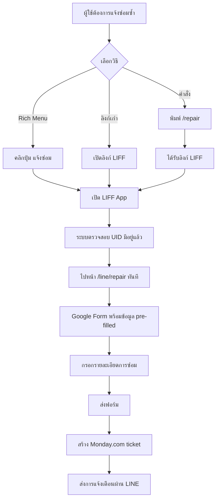

# LINE Rich Menu Setup สำหรับระบบแจ้งซ่อม

## ภาพรวม

Rich Menu ช่วยให้ผู้ใช้เข้าถึงฟังก์ชันต่างๆ ได้ง่ายขึ้น โดยไม่ต้องพิมพ์คำสั่ง

## 📱 การตั้งค่า Rich Menu

### 1. สร้างรูปภาพ Rich Menu

**ขนาด**: 2500x1686 pixels (อัตราส่วน 1.484:1)

**พื้นที่ที่แนะนำ**:
```
┌─────────────────────┬─────────────────────┐
│                     │                     │
│     🔧 แจ้งซ่อม      │     📋 สถานะ        │
│                     │                     │
├─────────────────────┼─────────────────────┤
│                     │                     │
│     ❓ ช่วยเหลือ     │     🏠 หน้าหลัก      │
│                     │                     │
└─────────────────────┴─────────────────────┘
```

### 2. สร้าง Rich Menu ผ่าน LINE API

```javascript
// rich-menu-setup.js
const LINE_CHANNEL_ACCESS_TOKEN = 'YOUR_CHANNEL_ACCESS_TOKEN';
const LIFF_ID = 'YOUR_LIFF_ID';
const BASE_URL = 'https://your-domain.com';

const richMenuData = {
  "size": {
    "width": 2500,
    "height": 1686
  },
  "selected": false,
  "name": "Repair System Menu",
  "chatBarText": "เมนูแจ้งซ่อม",
  "areas": [
    {
      "bounds": {
        "x": 0,
        "y": 0,
        "width": 1250,
        "height": 843
      },
      "action": {
        "type": "uri",
        "uri": `https://liff.line.me/${LIFF_ID}`
      }
    },
    {
      "bounds": {
        "x": 1250,
        "y": 0,
        "width": 1250,
        "height": 843
      },
      "action": {
        "type": "message",
        "text": "/status"
      }
    },
    {
      "bounds": {
        "x": 0,
        "y": 843,
        "width": 1250,
        "height": 843
      },
      "action": {
        "type": "message",
        "text": "/help"
      }
    },
    {
      "bounds": {
        "x": 1250,
        "y": 843,
        "width": 1250,
        "height": 843
      },
      "action": {
        "type": "uri",
        "uri": BASE_URL
      }
    }
  ]
};

// ฟังก์ชันสร้าง Rich Menu
async function createRichMenu() {
  const response = await fetch('https://api.line.me/v2/bot/richmenu', {
    method: 'POST',
    headers: {
      'Authorization': `Bearer ${LINE_CHANNEL_ACCESS_TOKEN}`,
      'Content-Type': 'application/json'
    },
    body: JSON.stringify(richMenuData)
  });
  
  const result = await response.json();
  console.log('Rich Menu Created:', result.richMenuId);
  return result.richMenuId;
}

// ฟังก์ชันอัปโหลดรูปภาพ
async function uploadRichMenuImage(richMenuId, imagePath) {
  const fs = require('fs');
  const imageBuffer = fs.readFileSync(imagePath);
  
  const response = await fetch(`https://api-data.line.me/v2/bot/richmenu/${richMenuId}/content`, {
    method: 'POST',
    headers: {
      'Authorization': `Bearer ${LINE_CHANNEL_ACCESS_TOKEN}`,
      'Content-Type': 'image/png'
    },
    body: imageBuffer
  });
  
  console.log('Image uploaded:', response.status);
}

// ฟังก์ชันกำหนด Rich Menu เป็นค่าเริ่มต้น
async function setDefaultRichMenu(richMenuId) {
  const response = await fetch(`https://api.line.me/v2/bot/user/all/richmenu/${richMenuId}`, {
    method: 'POST',
    headers: {
      'Authorization': `Bearer ${LINE_CHANNEL_ACCESS_TOKEN}`
    }
  });
  
  console.log('Default Rich Menu set:', response.status);
}

// รันการตั้งค่า
async function setupRichMenu() {
  try {
    const richMenuId = await createRichMenu();
    await uploadRichMenuImage(richMenuId, './rich-menu-image.png');
    await setDefaultRichMenu(richMenuId);
    console.log('Rich Menu setup completed!');
  } catch (error) {
    console.error('Error setting up Rich Menu:', error);
  }
}

// รันสคริปต์
setupRichMenu();
```

## 🤖 คำสั่งที่ผู้ใช้สามารถใช้ได้

ตอนนี้ผู้ใช้สามารถแจ้งซ่อมซ้ำได้หลายวิธี:

### 1. **คำสั่งข้อความ**
```
/repair      → เปิดฟอร์มแจ้งซ่อม
แจ้งซ่อม      → เปิดฟอร์มแจ้งซ่อม
/status     → ดูสถานะการซ่อม
/help       → ดูคำสั่งทั้งหมด
```

### 2. **Rich Menu**
- คลิกปุ่ม "🔧 แจ้งซ่อม" → เปิด LIFF App
- คลิกปุ่ม "📋 สถานะ" → ดูสถานะการซ่อม
- คลิกปุ่ม "❓ ช่วยเหลือ" → ดูคำสั่งทั้งหมด
- คลิกปุ่ม "🏠 หน้าหลัก" → ไปเว็บไซต์หลัก

### 3. **ลิงก์ LIFF โดยตรง**
ผู้ใช้สามารถเก็บลิงก์ไว้ในที่ผ่ายๆ:
```
https://liff.line.me/YOUR_LIFF_ID
```

## 📱 User Experience Flow

### สำหรับผู้ใช้เก่าที่ต้องการแจ้งซ่อมซ้ำ:



## 🎯 ข้อดีของแต่ละวิธี

### 1. **Rich Menu**
- ✅ ง่ายที่สุด แค่คลิก
- ✅ เห็นได้ตลอดเวลา
- ✅ เหมาะสำหรับผู้ใช้ทั่วไป

### 2. **คำสั่งข้อความ**
- ✅ รวดเร็ว สำหรับ power users
- ✅ ไม่ต้องอัปโหลดรูปภาพ
- ✅ ใช้งานได้ทันที

### 3. **ลิงก์ LIFF**
- ✅ แชร์ได้
- ✅ บันทึกเป็นบุ๊กมาร์กได้
- ✅ ใช้งานข้าม platform

## 🔧 การติดตั้ง

1. **อัปเดทโค้ด**: โค้ด webhook ได้อัปเดทแล้ว
2. **สร้าง Rich Menu**: ใช้สคริปต์ด้านบน
3. **ทดสอบ**: ลองส่งคำสั่ง `/repair` ใน LINE

**ผู้ใช้ตอนนี้สามารถแจ้งซ่อมซ้ำได้ง่ายขึ้นมาก!** 🎉