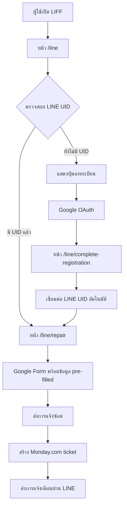

# การเชื่อมต่อ LINE UID สำหรับการแจ้งเตือน

## ภาพรวมระบบ

ระบบนี้รองรับการเข้าสู่ระบบแบบ Hybrid:
1. **Google Authentication**: สำหรับการยืนยันตัวตนหลัก
2. **LINE UID Linking**: สำหรับการส่งการแจ้งเตือนแบบส่วนบุคคล

## วิธีการทำงาน

### 1. การเข้าสู่ระบบผ่าน LINE (Entry Point)
- ผู้ใช้เปิดลิงก์ LIFF: `https://liff.line.me/YOUR_LIFF_ID`
- LIFF จะเปิดหน้า `/line` ที่ตรวจสอบสถานะผู้ใช้
- ระบบดึง LINE UID และ profile อัตโนมัติ

### 2. การตรวจสอบสถานะผู้ใช้
- **ถ้ามี LINE UID ในระบบแล้ว**: ไป Google Form ทันที
- **ถ้ายังไม่มี LINE UID**: ให้ลงทะเบียนด้วย Google OAuth ก่อน

### 3. การลงทะเบียนสำหรับผู้ใช้ใหม่
- คลิกปุ่ม "ลงทะเบียนด้วย Google"
- Google OAuth authentication
- ระบบเชื่อมต่อ LINE UID กับ Google account อัตโนมัติ
- Redirect ไป Google Form

### 4. การส่งการแจ้งเตือน
- เมื่อมีการแจ้งซ่อมผ่าน Google Forms
- ระบบส่งการแจ้งเตือนผ่าน LINE UID โดยอัตโนมัติ

## หน้าที่สำคัญ

### `/line` - หน้า Entry Point สำหรับ LINE LIFF

หน้านี้เป็นจุดเริ่มต้นของระบบ เมื่อผู้ใช้เปิดลิงก์ LIFF:

```typescript
// ฟังก์ชันตรวจสอบสถานะผู้ใช้
const checkUserStatus = async (lineUid: string) => {
  const response = await fetch(`/api/user/check-line?lineUid=${lineUid}`);
  return response.json();
};
```

**การทำงาน:**

- ตรวจสอบว่าอยู่ใน LINE App หรือไม่
- ดึง LINE Profile และ UID
- เช็คว่าผู้ใช้ลงทะเบียนแล้วหรือยัง
- แสดงปุ่มลงทะเบียนหรือไป Google Form

### `/line/complete-registration` - การเชื่อมต่อ LINE UID หลัง Google OAuth

หน้านี้จะทำงานหลังจากผู้ใช้ลงทะเบียนด้วย Google เสร็จแล้ว:

```typescript
// ฟังก์ชันเชื่อมต่อ LINE UID อัตโนมัติ
const linkLineUid = async (lineUid: string) => {
  const response = await fetch('/api/user/link-line', {
    method: 'POST',
    headers: { 'Content-Type': 'application/json' },
    body: JSON.stringify({ lineUid }),
  });
  return response.json();
};
```

### `/line/repair` - หน้า Google Form สำหรับ LINE

หน้านี้แสดง Google Form ที่เหมาะสำหรับ LINE App:

```typescript
// สร้าง URL ที่มีข้อมูลผู้ใช้ pre-filled
const googleFormUrl = `${GOOGLE_FORM_BASE_URL}?usp=pp_url&entry.${NAME_ENTRY}=${encodeURIComponent(profile.displayName)}&entry.${LINE_UID_ENTRY}=${encodeURIComponent(profile.userId)}`;
```

## โครงสร้างฐานข้อมูล

### User Table
```sql
model User {
  id            String         @id @default(cuid())
  name          String?
  email         String         @unique
  lineUserId    String?        @unique  -- LINE UID สำหรับการแจ้งเตือน
  googleId      String?        @unique  -- Google User ID
  role          UserRole       @default(USER)
  ...
}
```

## การใช้งาน

### สำหรับผู้ใช้ที่เข้าผ่าน LINE LIFF

1. ผู้ใช้เปิดลิงก์ LIFF ที่ชี้ไปหน้า `/line`
2. ระบบตรวจสอบสถานะ:
   - **มี LINE UID แล้ว**: ไปหน้า Google Form ทันที (`/line/repair`)
   - **ยังไม่มี LINE UID**: แสดงปุ่มลงทะเบียนด้วย Google
3. สำหรับผู้ใช้ใหม่:
   - คลิกลงทะเบียนด้วย Google → Google OAuth
   - หลัง OAuth สำเร็จ → ไปหน้า `/line/complete-registration`
   - ระบบเชื่อม LINE UID อัตโนมัติ → ไป Google Form

### สำหรับการแจ้งซ่อมผ่าน Google Forms

1. ผู้ใช้กรอก Google Form (ข้อมูลถูก pre-filled แล้ว)
2. Webhook ส่งข้อมูลมายัง `/api/webhooks/google-forms`
3. ระบบสร้าง repair ticket ใน Monday.com
4. ส่งการแจ้งเตือนผ่าน LINE Push Message

## API Endpoints

### `/api/user/link-line`

#### POST - เชื่อมต่อ LINE UID
```typescript
{
  "lineUid": "U1234567890abcdef...",
  "displayName": "ชื่อผู้ใช้",
  "pictureUrl": "https://profile.line-scdn.net/..."
}
```

#### GET - ตรวจสอบสถานะการเชื่อมต่อ
```typescript
{
  "user": {
    "id": "user_id",
    "lineUserId": "U1234567890abcdef...",
    "name": "ชื่อผู้ใช้",
    "email": "user@example.com"
  },
  "isLinked": true
}
```

#### DELETE - ยกเลิกการเชื่อมต่อ LINE UID
```typescript
{
  "success": true,
  "message": "ยกเลิกการเชื่อมต่อ LINE UID สำเร็จ"
}
```

## LINE Push Message API

### ส่งการแจ้งเตือนส่วนบุคคล
```typescript
import { sendRepairTicketNotification } from '@/lib/line-notifications';

await sendRepairTicketNotification(lineUserId, {
  ticketNumber: 'TK000001',
  title: 'เมาส์เสีย',
  status: 'PENDING',
  description: 'เมาส์ไม่สามารถคลิกได้',
  priority: 'MEDIUM'
});
```

## การตั้งค่า Environment Variables

```bash
# LINE Channel Configuration
LINE_CHANNEL_ACCESS_TOKEN="your-channel-access-token"
LINE_CHANNEL_SECRET="your-channel-secret"

# LIFF Configuration
NEXT_PUBLIC_LINE_LIFF_ID="1234567890-abcdefgh"

# LINE Group/Channel for admin notifications (optional)
LINE_GROUP_ID="C1234567890abcdef..."
```

## ตัวอย่างข้อความแจ้งเตือน

### การแจ้งซ่อมใหม่
```
⏳ แจ้งเตือนสถานะการซ่อม

📋 หมายเลข: TK000001
🏷️ หัวข้อ: เมาส์เสีย
📊 สถานะ: PENDING
🟡 ความสำคัญ: MEDIUM
📝 รายละเอียด: เมาส์ไม่สามารถคลิกได้

🕐 เวลา: 14/9/2567 10:30:00
```

### อัปเดตสถานะ
```
🔧 แจ้งเตือนสถานะการซ่อม

📋 หมายเลข: TK000001
🏷️ หัวข้อ: เมาส์เสีย
📊 สถานะ: IN_PROGRESS
🟡 ความสำคัญ: MEDIUM

🕐 เวลา: 14/9/2567 11:00:00
```

## ความปลอดภัย

### การตรวจสอบ LINE UID
- ตรวจสอบรูปแบบ LINE UID: `U[0-9a-f]{32}`
- ป้องกันการลิงก์ LINE UID เดียวกันกับหลายบัญชี
- เข้ารหัสการสื่อสารกับ LINE API ผ่าน HTTPS

### การจัดการข้อผิดพลาด
- Graceful fallback เมื่อ LINE API ไม่พร้อมใช้งาน
- Log errors สำหรับการ debug
- ไม่ block การทำงานหลักเมื่อการแจ้งเตือนล้มเหลว

## การทดสอบ

## สรุป Flow การทำงานของระบบ

### 🎯 LINE-First Workflow (ระบบใหม่)



### 📋 ขั้นตอนการใช้งาน

1. **Entry Point**: ผู้ใช้เปิดลิงก์ LIFF → หน้า `/line`
2. **User Detection**: ระบบเช็ค LINE UID ในฐานข้อมูล
3. **Conditional Flow**:
   - ✅ **มี UID**: ไป Google Form ทันที
   - ❌ **ไม่มี UID**: ลงทะเบียนด้วย Google ก่อน
4. **Registration**: Google OAuth → Auto-link LINE UID → Google Form
5. **Form Submission**: Pre-filled form → Monday.com → LINE notification

### 🔧 การตั้งค่า LIFF App

ใน LINE Developers Console:

- **Endpoint URL**: `https://your-domain.com/line`
- **App Type**: Compact หรือ Tall
- **Permissions**: `profile` (สำหรับดึงข้อมูล LINE Profile และ UID)

### ทดสอบการเชื่อมต่อ LINE UID
1. เข้าสู่ระบบด้วย Google
2. เปิดหน้า `/auth/link-line` ใน LINE App
3. ตรวจสอบว่า LINE UID ถูกบันทึกในฐานข้อมูล

### ทดสอบการส่งการแจ้งเตือน
1. สร้าง repair ticket ผ่าน Google Forms
2. ตรวจสอบ console logs
3. ตรวจสอบการรับข้อความใน LINE

## Troubleshooting

### ไม่สามารถเชื่อมต่อ LINE UID ได้
- ตรวจสอบ LIFF ID ใน environment variables
- ตรวจสอบ Endpoint URL ใน LIFF App settings
- ตรวจสอบ permissions (profile, openid)

### ไม่ได้รับการแจ้งเตือน LINE
- ตรวจสอบ LINE_CHANNEL_ACCESS_TOKEN
- ตรวจสอบว่า LINE UID ถูกลิงก์แล้ว
- ตรวจสอบ console logs สำหรับ error messages

### LIFF ไม่ทำงาน
- ตรวจสอบ domain ที่อนุญาตใน Channel settings
- ตรวจสอบ CORS policy
- ทดสอบใน LINE Developer Console